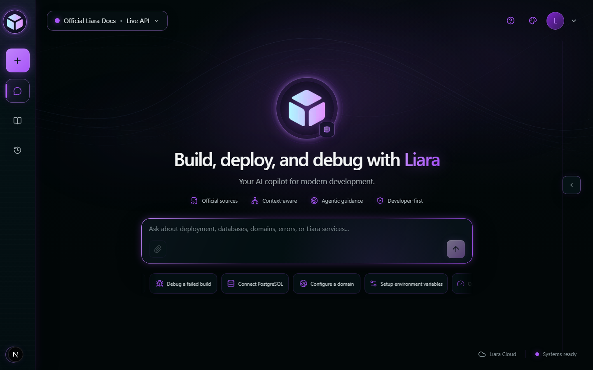
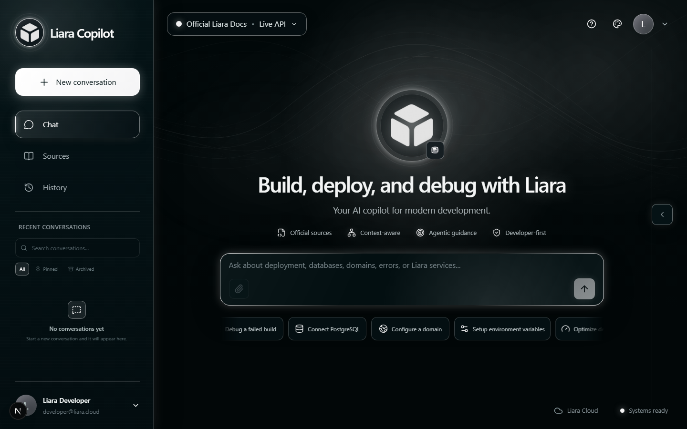
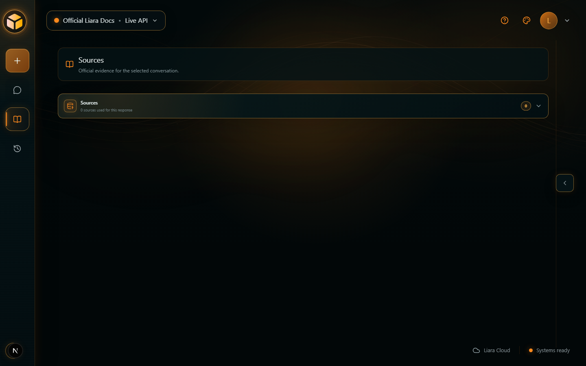
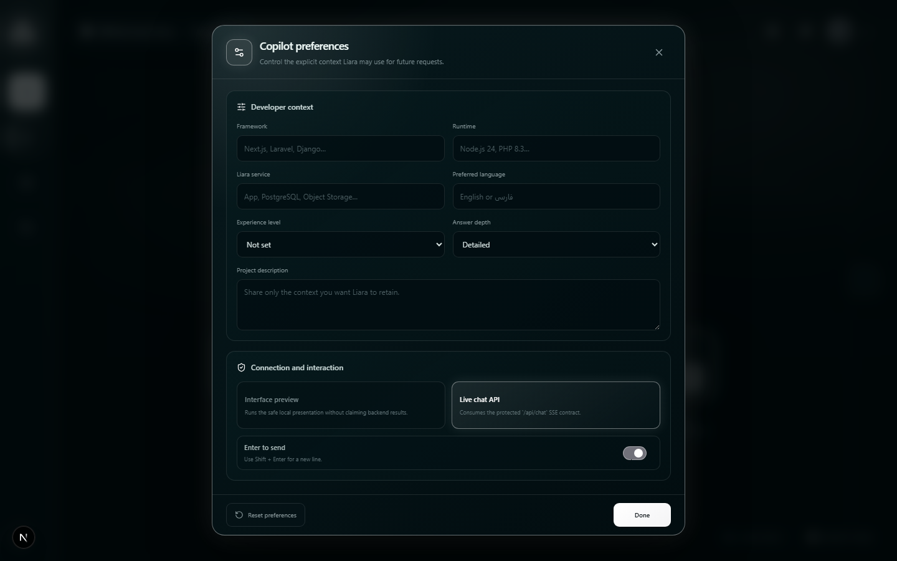
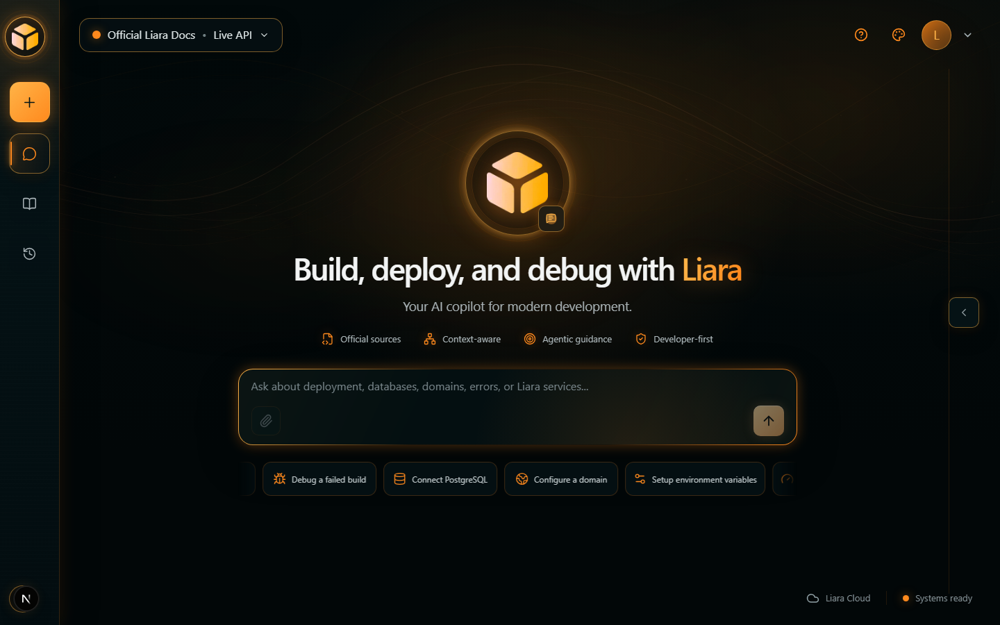
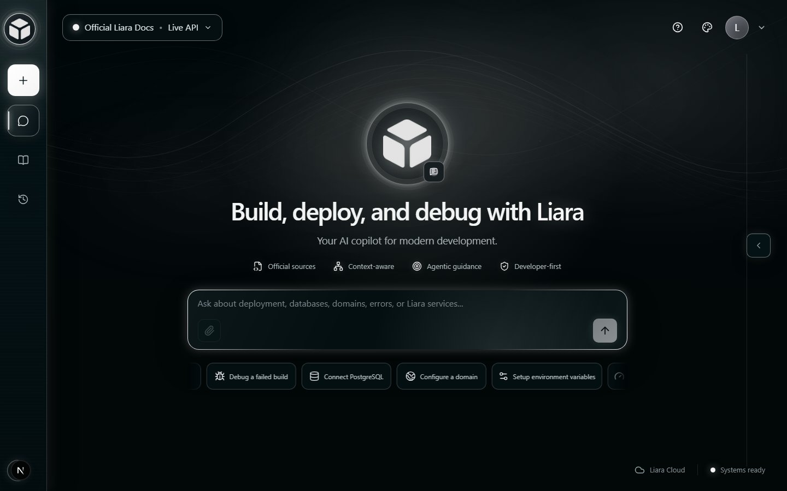
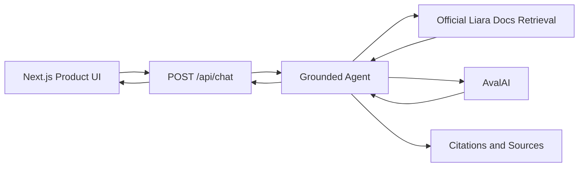

<div align="center">

# Liara Agentic Developer Copilot

> A grounded, citation-first AI copilot for deploying, debugging, and operating applications on Liara.

[](https://github.com/Fatima-Setayesh/liara-agentic-copilot/actions/workflows/ci.yml)


**[Official Liara Docs](https://docs.liara.ir/)** · **[Architecture](docs/architecture/ARCHITECTURE.md)** · **[Specification](SPEC.md)** · **[Judging Matrix](docs/JUDGING-MATRIX.md)**

</div>

<p align="center">
  
</p>

## Overview

Liara Agentic Developer Copilot helps developers understand, configure, deploy, and troubleshoot applications on [Liara](https://liara.ir/). It brings official documentation retrieval, grounded LLM responses, traceable citations, developer context, conversation continuity, and operational guidance into one focused interface.

Unlike a generic chatbot, the backend owns evidence selection and source metadata. Liara-specific claims are grounded in a revision-pinned copy of the official [`liara-cloud/docs`](https://github.com/liara-cloud/docs) repository. When reliable evidence is unavailable, the assistant says so instead of fabricating commands, platform behavior, or citations.

## Project status

**Feature-complete and deployment-ready.** Grounded chat, the product interface, conversation history, Sources, personalization, RTL/LTR support, accent themes, and backend production hardening are implemented. The latest release validation passed lint, strict type checking, 165 tests with 1 intentional skip, and a production build.

Production deployment has **not** yet been performed. Liara-specific runtime, streaming, and proxy behavior still require a live deployment validation.

## Highlights

| Capability | What it provides |
| --- | --- |
| **Grounded answers** | Bounded, ranked evidence from revision-pinned official Liara MDX documentation. |
| **Traceable sources** | Backend-created citations with allowlisted official URLs and source metadata. |
| **Streaming agent experience** | Real activity states, streamed text, citations, suggestions, and outcomes through `/api/chat`. |
| **Conversation continuity** | Browser-local conversations can be restored, searched, renamed, pinned, archived, and continued. |
| **Developer context** | Explicit framework, runtime, service, language, experience, depth, and project preferences. |
| **Bilingual UX** | Message-level RTL/LTR behavior plus deterministic Persian/English technical query normalization. |
| **Theme system** | Cyan, Violet, Blue, Orange, and White accent families powered by shared semantic tokens. |
| **Production-minded safety** | Validated inputs, strict budgets, timeout/cancellation, rate limiting, safe errors, logs, and security headers. |

## Product experience

<p align="center">
  
</p>
<p align="center"><em>Full workspace with expanded navigation and conversation access.</em></p>

<table>
  <tr>
    <td width="50%">
      
    </td>
    <td width="50%">
      
    </td>
  </tr>
  <tr>
    <td align="center"><strong>Traceable official sources</strong></td>
    <td align="center"><strong>Persistent conversation history</strong></td>
  </tr>
</table>

<p align="center">
  
</p>
<p align="center"><em>Explicit developer context and response preferences.</em></p>

## Accent themes

The interface uses centralized semantic theme tokens, so branding, navigation, cards, controls, workflow states, focus rings, ambient effects, and the search mascot share one consistent accent identity.

<table>
  <tr>
    <td width="33.33%"></td>
    <td width="33.33%"></td>
    <td width="33.33%"></td>
  </tr>
  <tr>
    <td align="center"><strong>Cyan</strong></td>
    <td align="center"><strong>Orange</strong></td>
    <td align="center"><strong>White</strong></td>
  </tr>
</table>

Violet and Blue themes are also available in the application.

## Architecture

The project is a single deployable Next.js application with strict boundaries between presentation, contracts, orchestration, retrieval, provider integration, and operational concerns.



The request flow is intentionally bounded:

1. The API validates the contract version, message and body size, user context, rate limit, and request identity.
2. Lightweight routing handles conversational messages without unnecessary retrieval or model calls; technical intent takes priority.
3. Retrieval normalizes Persian/English developer terminology and ranks an in-memory index of official Liara MDX.
4. The context builder deduplicates evidence and applies a strict character budget.
5. AvalAI receives the question and isolated evidence, then streams a grounded response.
6. The backend emits only allowlisted official sources and a typed `sufficient`, `partial`, or `none` evidence outcome.

See [`docs/architecture/ARCHITECTURE.md`](docs/architecture/ARCHITECTURE.md) and the accepted [`docs/adr`](docs/adr) decisions for details.

## Technology stack

| Layer | Technology |
| --- | --- |
| Runtime | Node.js 24, Next.js 16 App Router, React 19 |
| Language | TypeScript 5 in strict mode |
| UI | Tailwind CSS 4, CSS Modules, semantic theme tokens |
| AI | Vercel AI SDK 7 and AvalAI's OpenAI-compatible API |
| Validation | Zod 4 at request, response, and configuration boundaries |
| Retrieval | unified/remark structural MDX parsing and in-memory lexical ranking |
| Motion | Framer Motion 13 and Paper Design mesh shaders |
| Quality | Vitest 4, ESLint 9, strict typecheck, Next.js production build |
| Package manager | pnpm 10 only |

The current architecture needs no database, Redis, vector store, authentication vendor, queue, or telemetry SaaS.

## Try the copilot

Useful prompts for a local demo:

```text
How do I deploy a Next.js application on Liara?
چطور متغیرهای محیطی را در لیارا تنظیم کنم؟
Why did my Liara deployment fail?
How should I configure a custom domain?
```

Technical questions can return grounded answers with official Liara citations. Conversational messages are handled directly without pretending that documentation evidence is required.

## Quick start

### Prerequisites

- Node.js `24.x`
- Corepack or pnpm `10.x`
- Git
- your own AvalAI API key and compatible model ID
- a full 40-character Git revision from [`liara-cloud/docs`](https://github.com/liara-cloud/docs)

### Install and configure

```bash
corepack pnpm install --frozen-lockfile
cp .env.example .env.local
```

On Windows PowerShell, use `Copy-Item .env.example .env.local` instead of `cp`. If the PowerShell execution policy blocks `pnpm.ps1`, use `pnpm.cmd` or the `corepack pnpm` form.

Edit `.env.local` and provide your own credentials and pinned documentation revision:

```dotenv
AVALAI_API_KEY="your-own-avalai-api-key"
AVALAI_MODEL="your-compatible-model-id"
LIARA_DOCS_REVISION="full-40-character-liara-docs-commit"
```

Never use a Liara management API key as `AVALAI_API_KEY`, never commit `.env.local`, and never expose provider credentials through a `NEXT_PUBLIC_*` variable.

### Prepare the corpus and run

```bash
corepack pnpm prepare:docs
corepack pnpm dev
```

Open [http://localhost:3000](http://localhost:3000). `prepare:docs` verifies or fetches the pinned official repository into the ignored `.liara-docs` directory. Developers may optionally provide an existing clean checkout through `LIARA_DOCS_REPOSITORY_PATH`.

## Environment variables

| Variable | Required | Secret | Description |
| --- | :---: | :---: | --- |
| `AVALAI_API_KEY` | Yes | Yes | User-provided AvalAI server credential; no default |
| `AVALAI_MODEL` | Yes | No | Compatible model identifier; no default |
| `LIARA_DOCS_REVISION` | Yes | No | Full immutable Git revision for official documentation |
| `AVALAI_BASE_URL` | No | No | Provider endpoint; defaults to `https://api.avalai.ir/v1` |
| `AI_REQUEST_TIMEOUT_MS` | No | No | Request timeout; defaults to `45000` |
| `AI_MAX_OUTPUT_TOKENS` | No | No | Model output ceiling; defaults to `1200` |
| `AI_RETRIEVAL_LIMIT` | No | No | Maximum retrieval results; defaults to `6` |
| `CHAT_RATE_LIMIT_MAX_REQUESTS` | No | No | Per-instance request allowance; defaults to `20` |
| `CHAT_RATE_LIMIT_WINDOW_MS` | No | No | Rate-limit window; defaults to `60000` ms |
| `LIARA_DOCS_REPOSITORY_PATH` | Development only | No | Optional absolute local checkout override |

`LIARA_DOCS_REPOSITORY_PATH` should not normally be configured in production. Production uses the project-local corpus prepared during the build.

## API surface

### `POST /api/chat`

Accepts the protected v1 [`ChatRequest`](src/contracts/chat/v1/request.ts) and returns an AI SDK UI Message Stream over SSE. The stream carries native text parts, real agent states, citations, suggestions, safe errors, and terminal outcomes. User cancellation is a lifecycle outcome rather than an application error, and hidden chain-of-thought is never transmitted.

### `GET /api/health`

Validates AI, chat, and retrieval configuration without calling AvalAI, ingesting the corpus, or exposing configuration values. Responses are non-cached and suitable for a deployment health check.

## Quality gates

```bash
pnpm lint
pnpm typecheck
pnpm test
pnpm build
```

Latest verified release validation:

| Check | Result |
| --- | --- |
| ESLint | PASS |
| Strict TypeScript | PASS |
| Vitest | **165 passed, 1 skipped** |
| Production build | PASS |

GitHub Actions runs the same gate with Node.js 24, a frozen pnpm lockfile, and read-only repository permissions on changes targeting `integration` or `main`.

## Deployment

The application is designed to run as one Next.js service on Liara.

| Setting | Recommended value |
| --- | --- |
| Runtime | Node.js `24.x` |
| Package manager | pnpm `10.x` |
| Build command | `pnpm build` |
| Start command | `pnpm start` |
| Health endpoint | `GET /api/health` |

Required deployment variables are `AVALAI_API_KEY`, `AVALAI_MODEL`, and `LIARA_DOCS_REVISION`. `AVALAI_BASE_URL` may be set explicitly when required by the provider configuration.

Production builds prepare the pinned official documentation corpus and therefore require Git and outbound HTTPS access during the build. Runtime uses the prepared project-local `.liara-docs` directory and does not depend on a developer-machine path.

**Status:** production deployment has not yet been performed. Before release, validate pnpm/Corepack behavior, SSE proxy buffering, timeouts, disconnect cancellation, health checks, and production logs on Liara.

## Security and reliability

Implemented controls include:

- server-only AvalAI credentials and validated HTTPS provider configuration
- bounded schemas for request bodies, messages, user context, sources, and stream parts
- strict input, retrieval, context, output, and timeout budgets
- retrieval/model cancellation and client-disconnect propagation
- official Liara URL allowlisting and backend-owned citation metadata
- explicit separation of untrusted documentation evidence from system instructions
- stable typed client errors without raw provider payloads or stack traces
- isolated per-instance rate limiting
- request IDs and structured lifecycle logs without full prompts or retrieved context
- framing, referrer, content-type, and browser-permission security headers
- disabled framework-identifying response header and least-privilege CI

Production at multiple instances still requires a shared rate limiter and platform-level abuse controls. The project does not claim distributed enforcement.

## Current limitations

- Retrieval is an in-memory lexical baseline; hybrid or vector search should be considered only after measured quality evaluation.
- Conversations and preferences are browser-local, with no account sync or server-side persistence.
- Rate limiting and the cached retrieval index are process-local, not distributed.
- The official docs corpus is prepared at build time rather than served by a persistent search service.
- A real Liara production deployment and production SSE behavior have not yet been validated.

## Repository structure

```text
src/
├── app/          # Product routes and thin API boundaries
├── contracts/    # Versioned frontend/backend contracts
├── features/     # Chat, history, sources, settings, and product UI
└── server/       # Agent, AI, retrieval, security, logging, and monitoring
docs/             # Architecture, ADRs, judging matrix, and README assets
scripts/          # Official documentation corpus preparation
```

## Project documentation

- [`SPEC.md`](SPEC.md) — authoritative requirements and the 300-point judging priorities
- [`AGENTS.md`](AGENTS.md) — contributor ownership, security, Git, and coding-agent rules
- [`docs/architecture/ARCHITECTURE.md`](docs/architecture/ARCHITECTURE.md) — system boundaries and request flows
- [`docs/adr`](docs/adr) — accepted architecture decisions
- [`docs/JUDGING-MATRIX.md`](docs/JUDGING-MATRIX.md) — internal acceptance-evidence tracking

## Development workflow

```text
focused feature branch → integration → validation → main
```

Use pnpm only, keep commits focused and conventional, and run the quality gate before integration. Detailed contributor and agent rules live in [`AGENTS.md`](AGENTS.md).

## Authoritative knowledge policy

Liara-specific answers prefer:

1. [Published Liara documentation](https://docs.liara.ir/)
2. [Official Liara documentation repository](https://github.com/liara-cloud/docs)

If official evidence is insufficient, Liara Copilot says so and offers a useful next step. It must never fabricate a Liara command, configuration, price, service behavior, deployment instruction, or citation.

---

<div align="center">

Grounded. Traceable. Bilingual. Built for Liara developers.

</div>
