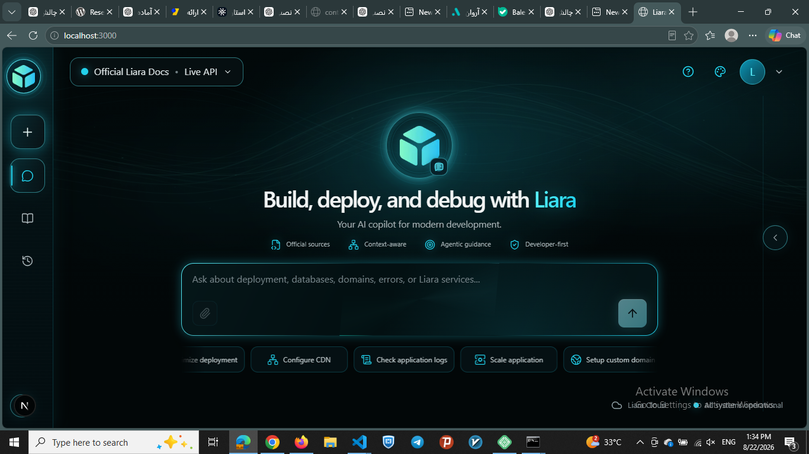
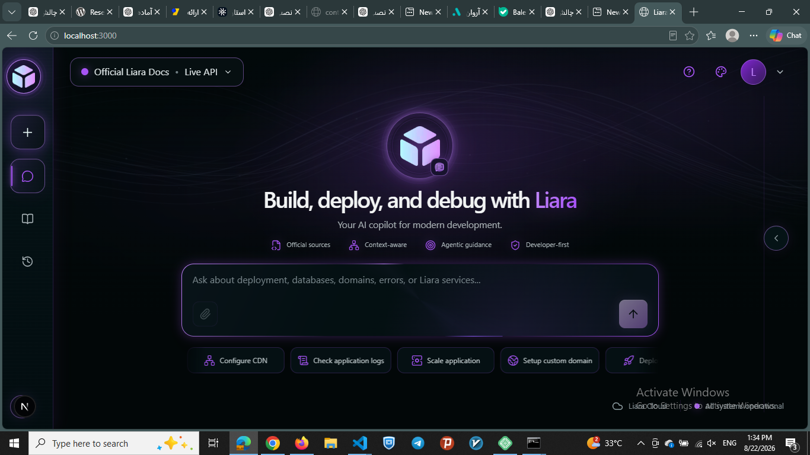
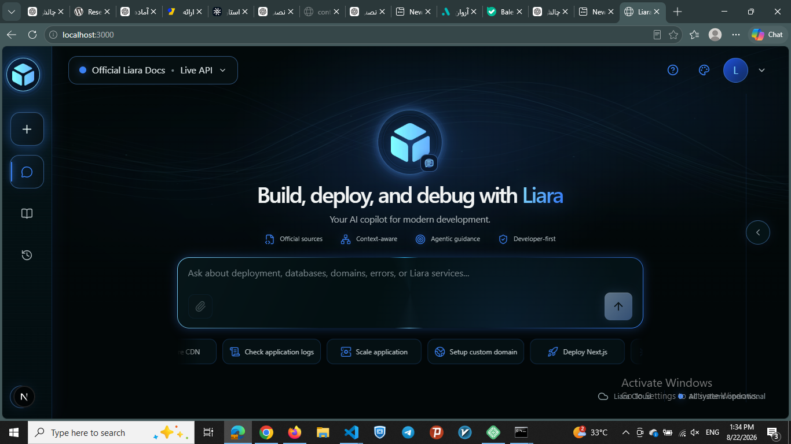
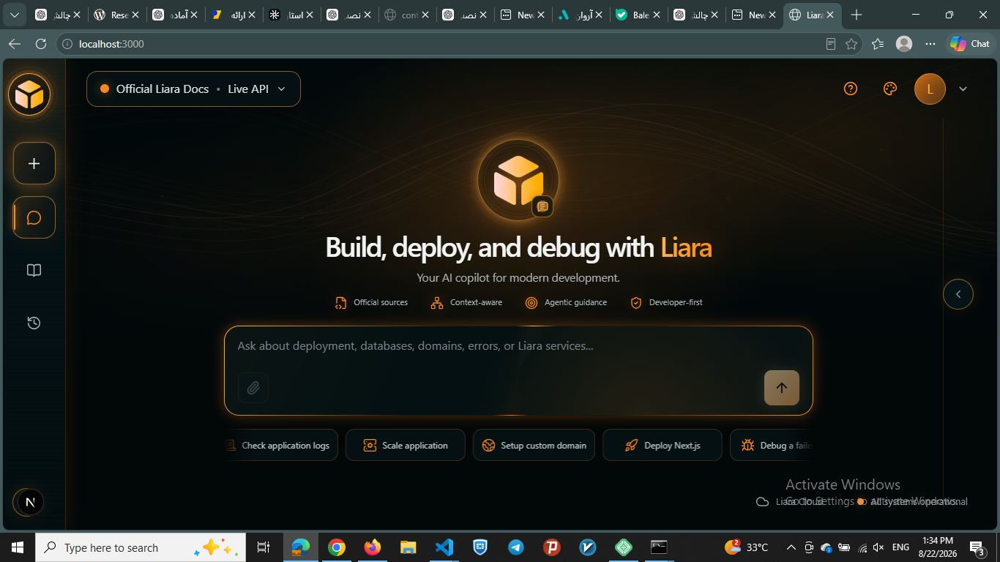
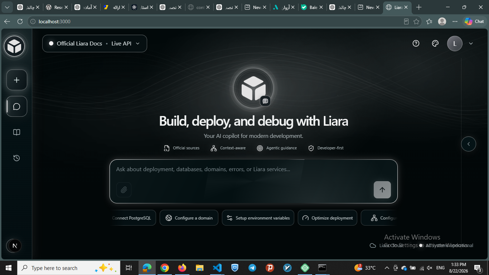
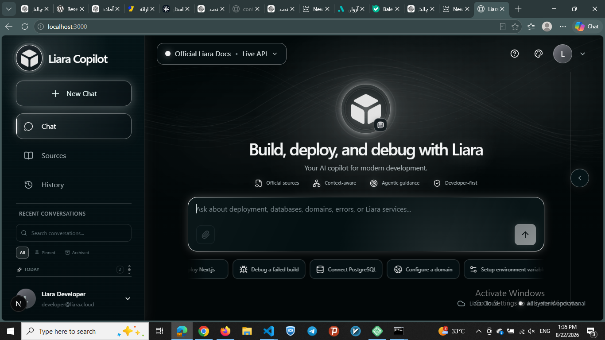
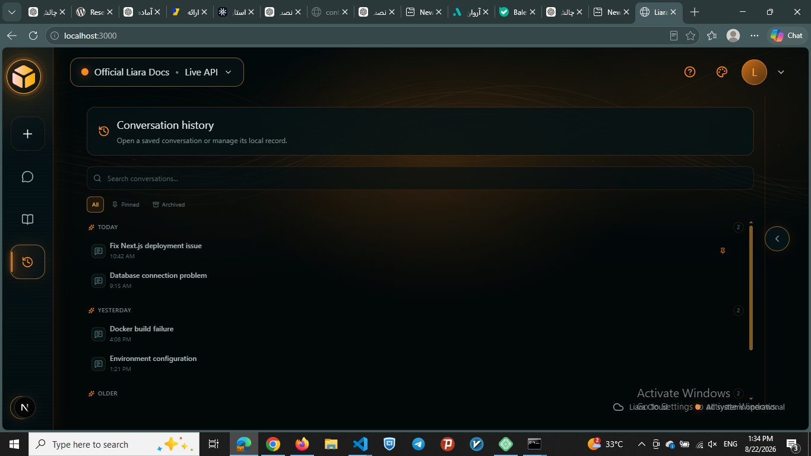
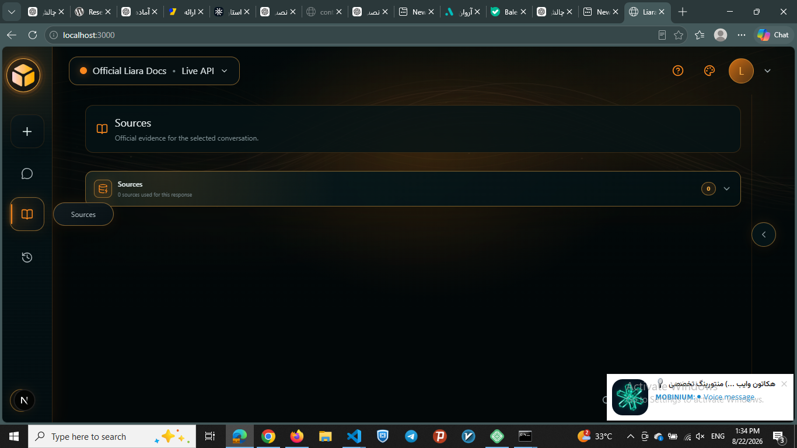
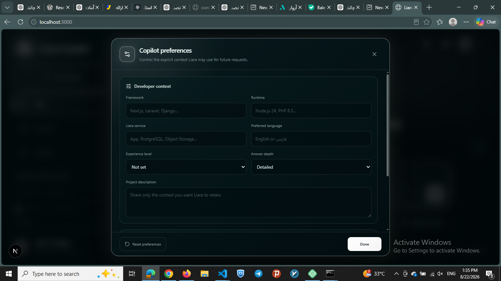
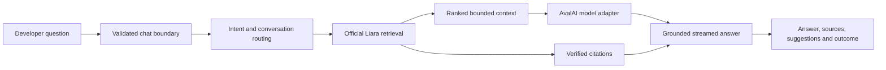

<div align="center">

# Liara Agentic Developer Copilot

### Build, deploy, and debug with grounded answers from official Liara documentation.

[](https://github.com/Fatima-Setayesh/liara-agentic-copilot/actions/workflows/ci.yml)


**[Official Liara Docs](https://docs.liara.ir/)** · **[Architecture](docs/architecture/ARCHITECTURE.md)** · **[Product Specification](SPEC.md)** · **[Judging Matrix](docs/JUDGING-MATRIX.md)**

</div>



## Overview

Liara Agentic Developer Copilot is a production-minded support assistant for developers building on [Liara](https://liara.ir/). It combines authoritative documentation retrieval, an agentic troubleshooting flow, AvalAI-powered generation, traceable citations, and a polished bilingual interface.

The product is deliberately more than a branded LLM wrapper. Liara-specific claims are grounded in the official [`liara-cloud/docs`](https://github.com/liara-cloud/docs) corpus, sources are created by the backend, and the assistant abstains when reliable evidence is unavailable instead of inventing commands or platform behavior.

## Product highlights

| Area | Implemented capability |
| --- | --- |
| **Grounded assistance** | Answers are generated from bounded, ranked evidence retrieved from official Liara MDX documentation. |
| **Agentic troubleshooting** | Real `understanding`, `retrieving`, and `generating` states make multi-step work visible without exposing hidden chain-of-thought. |
| **Traceable citations** | Every citation preserves its official URL, document path, heading, snippet, category, and stable source identity when available. |
| **Honest evidence handling** | Responses explicitly distinguish `sufficient`, `partial`, and `none` evidence; no result is not disguised as a backend failure. |
| **Bilingual query understanding** | Deterministic Persian/English normalization handles mixed-language developer terms, common aliases, and conversational phrasing without an extra classification model call. |
| **Streaming chat** | `POST /api/chat` streams text, activity, citations, suggestions, safe errors, and terminal outcomes over the AI SDK UI Message Stream protocol. |
| **Conversation experience** | Local conversation history supports restoration, search, rename, pin, archive, and delete actions. |
| **Personalization** | Users can explicitly set framework, runtime, Liara service, preferred language, experience level, answer depth, and project context. |
| **Accessible international UI** | Dynamic RTL/LTR direction keeps Persian, Arabic, and English messages readable while preserving the same product layout. |
| **Theme system** | Cyan, violet, blue, orange, and Liara White palettes share semantic accent tokens across the complete interface. |
| **Operational hardening** | Runtime validation, input/token limits, timeout and abort propagation, per-instance rate limiting, request IDs, safe structured logs, security headers, and `/api/health`. |

## Product tour

### One product, five accent identities

The theme system changes the complete accent identity—branding, navigation, composer, cards, states, focus rings, ambient light, and the animated search mascot—without changing the product structure.

<table>
  <tr>
    <td width="50%"></td>
    <td width="50%"></td>
  </tr>
  <tr>
    <td align="center"><strong>Electric Violet</strong></td>
    <td align="center"><strong>Luminous Blue</strong></td>
  </tr>
  <tr>
    <td></td>
    <td></td>
  </tr>
  <tr>
    <td align="center"><strong>Neon Amber</strong></td>
    <td align="center"><strong>Liara White</strong></td>
  </tr>
</table>

### Focused navigation and conversation history

<table>
  <tr>
    <td width="50%"></td>
    <td width="50%"></td>
  </tr>
  <tr>
    <td align="center"><strong>Compact and expanded navigation</strong></td>
    <td align="center"><strong>Searchable local history</strong></td>
  </tr>
</table>

### Official sources and explicit personalization

<table>
  <tr>
    <td width="50%"></td>
    <td width="50%"></td>
  </tr>
  <tr>
    <td align="center"><strong>Backend-owned evidence</strong></td>
    <td align="center"><strong>User-controlled context</strong></td>
  </tr>
</table>

## How it works



1. The API validates the versioned request, size limits, user context, rate limit, and request identity.
2. Lightweight intent routing handles greetings and conversational messages without wasting a retrieval or model call; technical intent always takes priority.
3. The retriever normalizes Persian/English technical vocabulary and ranks a bounded in-memory index built from revision-pinned official Liara MDX.
4. The context builder removes duplicate evidence and enforces a strict character budget.
5. AvalAI receives the user question plus isolated evidence and streams a grounded answer.
6. The backend emits only allowlisted official citations and a typed evidence outcome.

## Architecture

The project is a single deployable Next.js application with strict internal boundaries. This keeps hackathon operations simple while preventing UI, provider, retrieval, and security concerns from collapsing into one route.

```text
src/
├── app/
│   ├── (product)/           # Product entry point
│   └── api/                 # Thin chat and health HTTP boundaries
├── components/              # Shared frontend primitives
├── contracts/               # Versioned and runtime-validated shared contracts
├── features/                # Chat, history, settings, sources and product UI
└── server/
    ├── agent/               # Grounding, citations and orchestration
    ├── ai/                  # AvalAI adapter, prompts, budgets and context
    ├── chat/                # Request lifecycle, rate limiting and logging
    ├── monitoring/          # Safe deployment health checks
    └── retrieval/           # Ingestion, chunking, ranking and source policy
```

Key decisions and trade-offs are documented in [`docs/adr`](docs/adr):

- one full-stack Next.js deployable
- AI SDK UI Message Stream over SSE
- pinned raw-MDX retrieval baseline
- AvalAI through an OpenAI-compatible provider adapter

## Technology stack

- **Runtime:** Node.js 24, Next.js 16 App Router, React 19
- **Language:** TypeScript 5 with strict type checking
- **Styling:** Tailwind CSS 4, CSS Modules, semantic theme tokens
- **AI:** Vercel AI SDK 7 and AvalAI's OpenAI-compatible API
- **Validation:** Zod 4 at client/server and configuration boundaries
- **Retrieval:** structural MDX parsing with unified/remark and an in-memory lexical ranker
- **Motion:** Framer Motion and Paper Design mesh shaders
- **Testing:** Vitest 4, ESLint 9, production Next.js build validation
- **Package manager:** pnpm 10 only

No database, Redis, vector store, authentication vendor, queue, or monitoring SaaS is required by the current architecture.

## Getting started

### Prerequisites

- Node.js `24.x`
- pnpm `10.x` (the exact version is pinned in `package.json`)
- Git
- an AvalAI API key and model ID
- a full 40-character revision from the official [`liara-cloud/docs`](https://github.com/liara-cloud/docs) repository

### 1. Install dependencies

```bash
corepack enable
pnpm install --frozen-lockfile
```

Do not use npm or yarn; `pnpm-lock.yaml` is the only supported lockfile.

### 2. Configure the environment

```powershell
Copy-Item .env.example .env.local
```

On macOS or Linux:

```bash
cp .env.example .env.local
```

Set at least these server-only values:

```dotenv
AVALAI_API_KEY="your-avalai-api-key"
AVALAI_MODEL="your-avalai-model-id"
LIARA_DOCS_REVISION="full-40-character-liara-docs-commit"
```

`AVALAI_API_KEY` is an AvalAI provider credential—not a Liara management API key. Never expose it through a `NEXT_PUBLIC_*` variable.

### 3. Prepare the official documentation corpus

```bash
pnpm prepare:docs
```

The command verifies or fetches the pinned official repository into the ignored project-local `.liara-docs` directory. In development, `LIARA_DOCS_REPOSITORY_PATH` may point to an existing absolute, clean checkout. Production always uses the prepared project-local corpus and never a developer-machine path.

### 4. Start the application

```bash
pnpm dev
```

Open [http://localhost:3000](http://localhost:3000). Use `pnpm.cmd` or `corepack pnpm` if the PowerShell execution policy blocks the `pnpm.ps1` shim on Windows.

## Environment reference

| Variable | Required | Secret | Default / purpose |
| --- | :---: | :---: | --- |
| `AVALAI_API_KEY` | Yes | Yes | AvalAI server credential; no default |
| `AVALAI_MODEL` | Yes | No | Model identifier; no default |
| `LIARA_DOCS_REVISION` | Yes | No | Full immutable Git revision for official documentation |
| `AVALAI_BASE_URL` | No | No | `https://api.avalai.ir/v1` |
| `AI_REQUEST_TIMEOUT_MS` | No | No | `45000`; accepted range 5–120 seconds |
| `AI_MAX_OUTPUT_TOKENS` | No | No | `1200`; bounded to 128–4096 |
| `AI_RETRIEVAL_LIMIT` | No | No | `6`; bounded to 1–10 results |
| `CHAT_RATE_LIMIT_MAX_REQUESTS` | No | No | `20` requests per in-process window |
| `CHAT_RATE_LIMIT_WINDOW_MS` | No | No | `60000` milliseconds |
| `LIARA_DOCS_REPOSITORY_PATH` | Development only | No | Optional absolute local checkout override |

All runtime configuration is parsed before use and fails with safe, non-secret errors when invalid.

## API and streaming contract

### `POST /api/chat`

Accepts the protected v1 [`ChatRequest`](src/contracts/chat/v1/request.ts) and returns an AI SDK UI Message Stream over SSE.

The stream may contain:

- native text start/delta/end parts
- transient `data-agent-state` activity events
- persistent `data-citation` official sources
- persistent `data-suggestions` next actions
- persistent `data-outcome` with `completed`, `cancelled`, or `failed`
- safe `data-error` payloads for anticipated post-header failures

The frontend never manufactures citation fields. Cancellation is a terminal lifecycle outcome rather than an application error, and hidden chain-of-thought is never transmitted.

### `GET /api/health`

Returns a small non-cached health response for AI, chat, and retrieval configuration. It does not call AvalAI, ingest the corpus, or reveal configuration values.

## Security, reliability, and cost controls

- strict schemas and an 8,000-character user-message limit
- bounded request body, retrieval count, evidence context, and model output
- timeout and cancellation propagation through retrieval and model generation
- stable safe error codes with no raw provider payloads or stack traces
- per-process in-memory rate limiting behind an isolated replaceable interface
- request IDs and concise structured lifecycle logs without full prompts or retrieved context
- official-source URL allowlisting and backend-owned source metadata
- retrieved documentation treated as untrusted evidence, not executable instructions
- baseline framing, referrer, content-type, and browser-permission security headers
- one cached corpus/index initialization per server process
- deterministic conversational routing that avoids unnecessary model calls

## Scripts

| Command | Purpose |
| --- | --- |
| `pnpm dev` | Start the local development server |
| `pnpm prepare:docs` | Prepare or verify the pinned official Liara corpus |
| `pnpm lint` | Run ESLint with zero warnings allowed |
| `pnpm typecheck` | Run strict TypeScript validation without emitting files |
| `pnpm test` | Run the Vitest suite once |
| `pnpm test:watch` | Run Vitest in watch mode |
| `pnpm build` | Prepare the corpus and create a production Next.js build |
| `pnpm start` | Start a previously built production server |

Run the complete local validation gate before integration:

```bash
pnpm lint
pnpm typecheck
pnpm test
pnpm build
```

GitHub Actions runs the same checks on pushes and pull requests targeting `integration` or `main` with a frozen pnpm lockfile and read-only repository permissions.

## Deployment direction

The application targets Liara's Next.js platform with Node.js 24 and standard `build` / `start` scripts. The production build prepares the exact official documentation revision into `.liara-docs`; runtime processes reuse the resulting in-memory index.

Before the first production release, verify these platform-specific items on Liara:

- pnpm lockfile and Corepack behavior
- required server-only environment variables
- SSE streaming and proxy buffering
- request timeout and client-disconnect behavior
- `/api/health` command/path configuration
- production log visibility and multi-instance rate-limit implications

No deployment action or secret is embedded in this repository. See the [architecture deployment notes](docs/architecture/ARCHITECTURE.md#liara-deployment-direction) for the current verified direction.

## Known limitations

- Retrieval is a deterministic lexical baseline; vector or hybrid search should be added only if measured evaluation demonstrates a material quality gain.
- Conversation transcripts and preferences are browser-local. There is no account sync or server-side persistence.
- Rate limiting is per server process. Multiple production instances require a shared limiter for consistent global enforcement.
- The corpus/index is rebuilt once per server-process cold start and retained in memory; it is not distributed.
- Liara production deployment and platform-level SSE behavior still require an explicitly authorized live validation.

## Project documentation

- [`SPEC.md`](SPEC.md) — authoritative product requirements and 300-point judging priorities
- [`AGENTS.md`](AGENTS.md) — ownership, security, Git, and coding-agent operating rules
- [`docs/architecture/ARCHITECTURE.md`](docs/architecture/ARCHITECTURE.md) — system boundaries and request flows
- [`docs/adr`](docs/adr) — consequential architecture decisions
- [`docs/JUDGING-MATRIX.md`](docs/JUDGING-MATRIX.md) — internal implementation and acceptance-evidence tracking

## Authoritative knowledge policy

Liara-specific answers must prefer:

1. [Published Liara documentation](https://docs.liara.ir/)
2. [Official Liara documentation repository](https://github.com/liara-cloud/docs)

If retrieved official evidence is insufficient, Liara Copilot says so and offers a useful next step. It must never fabricate a Liara command, configuration, price, service behavior, deployment instruction, or citation.

---

<div align="center">

Built for reliable Liara developer support—grounded, traceable, bilingual, and production-minded.

</div>
