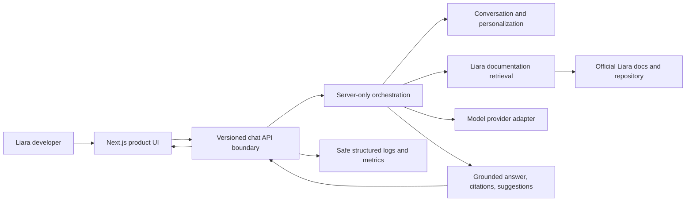

# Architecture

Status: foundation baseline
Last reviewed: 2026-08-20

## Goals

The architecture optimizes for answer correctness, low hallucination risk, visible judging evidence, two-person delivery speed, clear ownership, security, low operating complexity, and a reliable Liara demo. The initial system is one Next.js full-stack application with explicit boundaries rather than multiple deployables.

## System context



Only the UI scaffold and protected contracts exist today. Server components in the diagram are planned boundaries, not claimed implementations.

## Deployment unit

The selected direction is one Next.js App Router application:

- one repository and dependency graph
- one build and runtime boundary
- same-origin product UI and API
- server-only modules under `src/server/`
- Route Handlers as thin HTTP adapters under `src/app/api/`

This avoids cross-service authentication, CORS, duplicate deployment configuration, and extra operational failure modes during the hackathon. A split requires measured evidence that Liara runtime constraints, independent scaling, or another concrete need outweighs those costs.

See [ADR-0001](../adr/0001-single-nextjs-application.md).

## Repository boundaries and ownership

| Area | Responsibility | Owner |
| --- | --- | --- |
| `src/app/(product)/` and visible page composition | Product routes and UX | Frontend / Fatima |
| `src/components/`, `src/features/`, `src/styles/` | UI primitives, visible features, accessibility | Frontend / Fatima |
| `src/app/api/` | Thin HTTP/stream boundaries | Backend/platform |
| `src/server/` | Orchestration, retrieval, providers, context, security, observability, cost, persistence | Backend/platform |
| `src/contracts/` | Runtime schemas and shared types | Shared and protected |
| root configs, CI, deployment files | Architecture and platform | Backend/platform; coordinate breaking changes |
| `components.json` | Optional frontend component-generation configuration | Shared and protected |

The foundation page is intentionally minimal. Backend work must not redesign the visible product, and frontend work must not construct citations or move server policy into browser code.

## Component model

Planned server modules are organized by capability, not framework convenience:

```text
src/server/
|- ai/                 provider-neutral generation interface and adapters
|- agent/              intent, clarification, workflow, next-step orchestration
|- retrieval/          ingest, query, rank, and evidence selection
|- conversations/      bounded history and summaries
|- personalization/    explicit user-provided preferences and context
|- security/           validation policy, abuse controls, redaction, budgets
|- monitoring/         latency, usage, outcome, and error metrics
|- logging/            structured safe logging and request correlation
|- cost/               routing, token budgets, caching, duplicate protection
`- db/                 persistence adapters only after a storage ADR
```

Directories should be created when their first real module lands. API handlers parse input, establish request identity/cancellation, call an application service, and translate typed results; they do not contain the full workflow.

## Request flow

1. The client sends chat contract v1: latest user message, optional conversation ID, optional client request ID, and permitted user context.
2. The API validates the body with the shared Zod schema and applies length, rate, token, and timeout policy.
3. The agent understands intent and decides whether decision-critical clarification is required.
4. For answerable Liara questions, retrieval returns a small ranked evidence set with traceable metadata.
5. Context selection combines relevant conversation state, explicit preferences, and retrieved evidence within a token budget.
6. The provider adapter streams a grounded answer; it does not invent source metadata.
7. The server emits safe typed data parts for citations, suggestions, real activity states, and in-stream errors.
8. Completion records latency, usage, retrieval count, outcome, and normalized error state without secrets.

## AI and agent flow

The model is one component, not the source of truth or workflow owner.

```text
validated request
  -> intent and ambiguity assessment
  -> clarification OR authoritative retrieval
  -> bounded context assembly
  -> provider-neutral model call
  -> grounded output and structured metadata
  -> integrity checks
  -> stream completion
```

Clarification is selective. “My app does not deploy” may need framework and failure-stage details; a documented “How do I deploy Next.js?” question should retrieve and answer without needless interrogation.

No hidden chain-of-thought is requested or transmitted. `reasoning` and `executing` are not v1 product states because the foundation has no corresponding visible operation.

## Retrieval flow

The primary corpus is the official [`liara-cloud/docs`](https://github.com/liara-cloud/docs) repository, with published canonical pages at [`docs.liara.ir`](https://docs.liara.ir/).

The source repository primarily stores content in `src/pages/**/*.mdx`. A future ingestion pipeline should:

1. fetch a pinned official revision
2. parse MDX structurally rather than treating JSX boilerplate as prose
3. retain prose, warnings, tab labels/content, commands, headings, and section IDs
4. derive candidate published routes by removing `src/pages/` and `.mdx`
5. validate canonical URLs against the official sitemap
6. chunk along page and section boundaries with overlap only where measured useful
7. store source revision/content hash, page and section identity, language, category, and chunk order
8. build a retrieval index appropriate to measured corpus size and quality needs

The official repository already contains `indexer/` and `sitemap/` areas; inspect and reuse them where appropriate before building a duplicate crawler.

No vector database or embedding provider has been selected. The next retrieval task must benchmark a low-complexity lexical baseline and inspect the corpus before justifying storage infrastructure.

## Citation flow

Retrieval metadata stays associated with evidence through generation. The backend creates citation objects only from allowlisted official sources. The v1 client-visible source shape includes ID, title, HTTPS URL, and optional section, repository path, snippet, and category.

The current allowlist is:

- `https://docs.liara.ir/**`
- `https://github.com/liara-cloud/docs/**`

Ranking score, embedding identifiers, raw provider metadata, and other internal diagnostics are not client fields. The frontend renders citation parts and never guesses a title, URL, section, or snippet.

## Conversation and context flow

The request does not resend unlimited UI history. `DefaultChatTransport.prepareSendMessagesRequest` will eventually translate the UI action into protected `ChatRequest` v1 containing the latest message and identifiers.

Server-side context may preserve only evidence-backed or user-provided facts such as framework, runtime, Liara service, project description, experience, answer depth, and preferred language. The design must support:

- recent-turn trimming
- relevance selection
- summary replacement for older turns
- per-request token budgets
- explicit preference update/reset
- no invented profile attributes

Persistence technology and retention policy are deferred until the conversation requirements and Liara storage options are verified.

## Streaming boundary

The accepted planned transport is AI SDK 7’s UI Message Stream Protocol over SSE:

- native text start/delta/end parts for answer content
- persistent `data-citation` parts for authoritative source payloads
- persistent `data-suggestions` for next actions
- transient `data-agent-state` for real state transitions
- `data-error` for anticipated failures after headers are committed
- structured JSON errors for failures before streaming starts
- native finish plus final `completed` state for successful answers

Client cancellation uses `useChat().stop()`. Request abort signals must propagate through retrieval and `streamText`; server stream consumption/finalization must still run. Resume support is deferred because resumable streams conflict with abort semantics. Reasoning transmission remains disabled.

See [ADR-0002](../adr/0002-ai-sdk-ui-message-stream.md).

## Security boundary

The browser receives no provider, database, or platform secret. Trust boundaries are:

- browser to API: strict request schema, input limit, origin/abuse policy
- API to orchestration: authenticated/authorized identity only if a real product flow requires it
- retrieval to prompt: treat documentation as untrusted content and isolate instructions
- orchestration to provider: minimal required context and server-only credentials
- server to logs: redaction and structured allowlisted fields
- server to client: stable safe errors and citation/source policy

Baseline response hardening disables the identifying header and adds content-type, framing, referrer, and browser-feature policies. A tested Content Security Policy should be added with the real frontend rather than guessed before its resource needs are known.

## Reliability boundary

Each external step gets its own timeout, cancellation, error normalization, and observability. The system distinguishes invalid input, rate limiting, retrieval failure, no evidence, provider unavailability, stream interruption, and internal failure. A no-result outcome is not silently converted into an ungrounded answer.

Client request IDs provide a future duplicate-request key. Health checks must prove process health without invoking the model or retrieval system.

## Observability boundary

One request ID follows the API, retrieval, provider, stream, and safe error. Planned structured fields include timestamp, total/retrieval/model latency, provider, model, token usage, budget decisions, retrieval count, cancellation/completion outcome, and normalized error code.

Do not record credentials, cookies, full sensitive prompts, raw stack traces in client errors, or source content beyond what diagnosis requires. Start with structured application logs and measured demo evidence before adding an external monitoring vendor.

## Cost boundary

Cost policy belongs outside components and provider adapters. It will set:

- task-aware model routing
- retrieval and rerank limits
- input and output token ceilings
- bounded history and summaries
- duplicate-request handling
- safe cache keys and TTLs
- usage and estimated-cost records

Answer quality and citation correctness are hard constraints; negligible savings do not justify weaker evidence.

## Liara deployment direction

[Official Liara documentation](https://github.com/liara-cloud/docs/tree/master/src/pages/paas) currently confirms:

- a dedicated `next` platform
- Node.js 20, 22 (default), and 24 for that platform
- standard `build` and `start` scripts
- configurable port, Node version, environment settings, and command-based health checks in `liara.json`
- CLI, console, and GitHub deployment paths
- health-check-gated traffic promotion

This project targets Node 24 locally and in CI. No `liara.json` is committed yet because the current official Next.js page explicitly describes dependency installation with `npm install`, which conflicts with the non-negotiable pnpm-only lockfile policy. Before deployment configuration:

1. verify whether the current Liara Next builder honors `packageManager` and `pnpm-lock.yaml`
2. verify exact install/build/start behavior using a disposable deployment
3. confirm port/host behavior
4. validate AI SDK SSE chunking, buffering, timeout, cancellation, and disconnect cleanup
5. add a cheap health endpoint and command
6. configure secrets through protected Liara variables, never committed `envs`

Deployment and those external changes require explicit user authorization.

Verified source pages:

- [Next.js deployment](https://github.com/liara-cloud/docs/blob/master/src/pages/paas/nextjs/how-tos/deploy-app.mdx)
- [Next.js Node versions](https://github.com/liara-cloud/docs/blob/master/src/pages/paas/nextjs/how-tos/choose-version.mdx)
- [Health checks](https://github.com/liara-cloud/docs/blob/master/src/pages/paas/details/health-check.mdx)

## Major tradeoffs and deferred decisions

| Decision | Current choice | Tradeoff / trigger to revisit |
| --- | --- | --- |
| Deployable shape | One Next.js app | Split only for verified platform or scaling need |
| Stream protocol | AI SDK UI Message Stream | Couples shared parts to AI SDK semantics but avoids custom protocol risk |
| Model/provider | Deferred behind adapter | Select after quality, access, latency, and cost evaluation |
| Retrieval index | Deferred | Benchmark corpus and lexical baseline before vector infrastructure |
| Database | Deferred | Select only when conversation/index persistence requirements are concrete |
| Authentication | Deferred | Add only for a validated identity-dependent product flow |
| Monitoring vendor | Deferred | Structured logs first; add only for measurable value |
| Liara config | Deferred | pnpm builder and production streaming must be verified |
